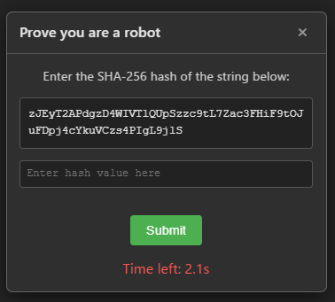
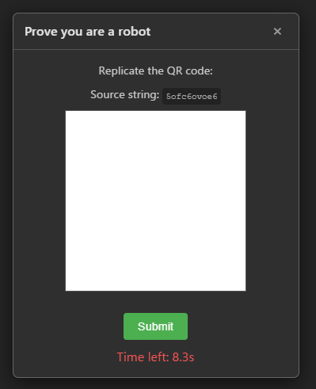
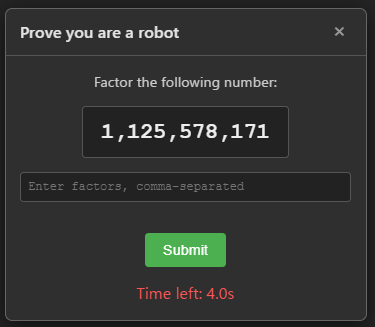

# I am a Robot CAPTCHA

> [!NOTE]
> このコードはほとんどGemini 3.0 Proによって書かれました。内容には目を通していますが、あくまでジョークとしてお使いください。

[English](./README.md)

## 概要

このライブラリは、一般的なCAPTCHAとは逆のひねりを加えたものです。人間であることを証明する代わりに、提示されるチャレンジはボットやプログラムにとっては簡単ですが、人間にとっては困難または面倒なように設計されています。「私はロボットです」というテーマの逆CAPTCHAとして機能します。

## 機能

- 複数のチャレンジタイプから選択可能
- 特定のチャレンジを選択、または毎回ランダムにチャレンジを提示
- あらゆるウェブページへの簡単な統合
- 認証は一定時間（現在15秒）で自動的に失効
- デモンストレーションおよびテスト用のソルバーボットを同梱

## チャレンジの種類

現在、このライブラリは以下のチャレンジをサポートしています。

- **SHA-256:** 与えられたランダムな文字列のSHA-256ハッシュ値を、短い制限時間内に計算して入力する必要があります。
  
- **QRコード:** 与えられた元文字列に基づき、バージョン1のQRコードを21x21のグリッド上で再現する必要があります。
  
- **素因数分解:** 大きな合成数の素因数を2つ見つける必要があります。
  

## 使用方法

1.  HTMLファイルに、CAPTCHAウィジェットを配置するためのルートコンテナを追加します。
    ```html
    <div id="root"></div>
    ```

2.  HTMLファイルにメインスクリプトを読み込みます。
    ```html
    <script type="module" src="/src/index.ts"></script>
    ```

3.  チャレンジの種類を設定するには、ルートコンテナに `data-challenge` 属性を追加します。メインスクリプトはこの属性を自動的に読み取ります。

    `data-challenge` に設定可能な有効な値は以下の通りです。
    - `sha256`
    - `qrcode`
    - `prime`
    - `random` (CAPTCHAがクリックされるたびに、上記の中からランダムに一つを選択します)

    **設定例:**
    ```html
    <!-- この設定では、CAPTCHAがクリックされるたびにランダムなチャレンジが選択されます -->
    <div id="root" data-challenge="random"></div>
    ```
